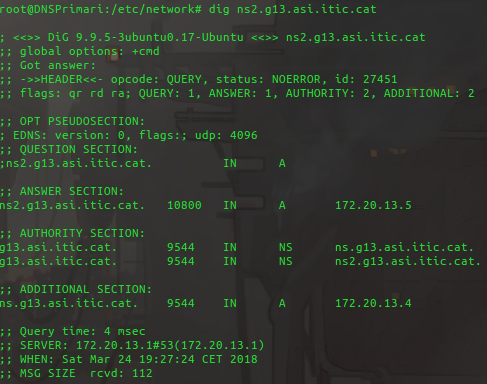
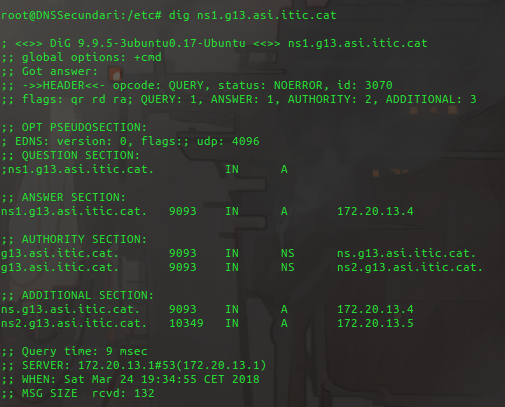
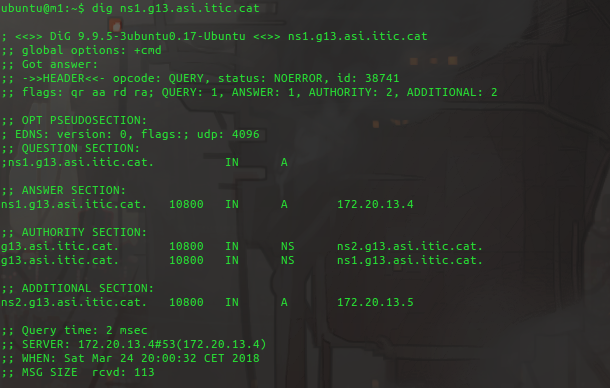

Pràctica 3: Servei de noms
==========================

:Autor: Joan Jiménez Alarcón
:Data: 25 de Març de 2018

---------------------

Objectiu de la pràctica
------------------------
L'objectiu d'aquesta pràctica és implementar servidors DNS i configurar-los. Per a assolir aquest objectiu s'ha utilitzat el paquet bind9.

Tasques realitzades
-------------------

El primer pas ha estat crear dues màquines virtuals noves, on hi haurà els serveis de DNS primari i secundari. A cadascuna se li ha assignat una IP dins del rang assignat del VPN de l'assignatura al grup, i s'ha respectat el pacte de que aquestes màquines tinguin la IP 172.20.13.4 pel DNS primari i la IP 172.20.13.5 pel DNS secundari.

Els passos per a crear i configurar la màquina del DNS Primari i Secundari han estat els següents:

Pas 1 - Fitxer */var/lib/lxc/<NOM_MAQUINA>/config*
^^^^^^^^^^^^^^^^^^^^^^^^^^^^^^^^^^^^^^^^^^^^^^^^^^^^

S'ha modificat aquest fitxer de configuració del contenidor per tal d'establir una IP fixa en la màquina <NOM_MAQUINA> (s'ha de fer tant en la màquina encarregada del DNS Primari com a la del DNS Secundari. Ha quedat de la següent manera:

Pel DNS Primari:

.. code-block:: raw
  :include: memoria/configprimari

Pel DNS Secundari:

.. code-block:: raw
  :include: memoria/configsecundari

Pas 2 - Fitxer */var/lib/lxc/<NOM_MAQUINA>/rootfs/etc/network/interfaces*
^^^^^^^^^^^^^^^^^^^^^^^^^^^^^^^^^^^^^^^^^^^^^^^^^^^^^^^^^^^^^^^^^^^^^^^^^^

El següent pas ha estat modificar el fitxer interfaces de les màquines virtuals tant del DNS Primari com del Secundari.

En ambdues màquines el fitxer ha quedat configurat de la mateixa manera:

.. code-block:: raw
  :include: memoria/interfacesprimari

Després d'efectuar un reboot a la màquina virtual (necessari després de modificar el fitxer *interfaces*) comprovem que el fitxer */etc/resolv.conf* té la entrada *nameserver 127.0.0.1*. Si apareix aquesta entrada, sabem que hem modificat el fitxer *interfaces* correctament.

Pas 3 - Fitxer */var/lib/lxc/<NOM_MAQUINA>/rootfs/etc/bind/named.conf.local*
^^^^^^^^^^^^^^^^^^^^^^^^^^^^^^^^^^^^^^^^^^^^^^^^^^^^^^^^^^^^^^^^^^^^^^^^^^^^

En aquest fitxer definim la nostra zona d'autoritat de la següent manera:

Pel DNS Primari, que actuarà de master:

.. code-block:: raw
  :include: memoria/conflocalprimari

Pel DNS Secundari, que actuarà de slave:

.. code-block:: raw
  :include: memoria/conflocalsecundari

Pas 4 - Fitxer */var/lib/lxc/<NOM_MAQUINA>/rootfs/etc/bind/db.g13.asi.itic.cat*
^^^^^^^^^^^^^^^^^^^^^^^^^^^^^^^^^^^^^^^^^^^^^^^^^^^^^^^^^^^^^^^^^^^^^^^^^^^^^^^^

Creem aquest fitxer dins el directori indicat en ambdues màquines. Aquest fitxer contindrà la nostra taula de resolució de noms amb els registres tipus A que vinculen aquests noms amb les adreces IP de les màquines necessàries. El fitxer queda de la següent manera tant en el DNS Primari com en el Secundari:

.. code-block:: raw
  :include: memoria/dbg13

Un cop hem creat aquest fitxer, per tal de que el servei *bind* reconegui els canvis, cal executar la comanda *service bind9 reload*.
Ja tenim els dos servidors configurats.

Pas 5 - Proves de resolució de noms
^^^^^^^^^^^^^^^^^^^^^^^^^^^^^^^^^^^^

Finalment, executem un petit joc de proves per veure que el nostre servei de resolució de noms està funcionant correctament.

Aquestes proves s'han realitzat amb la eina *dig*.

1) Des de la màquina DNSPrimari fem un *dig* a la màquina DNSSecundari mitjançant *dig ns2.g13.asi.itic.cat*. El resultat és el següent:

S'observa com la resolució de noms s'ha efectuat correctament, ja que s'obtè resposta de la direcció esperada.

2) Des de la màquina DNSSecundari fem un *dig* a la màquina DNSPrimari mitjançant *dig ns1.g13.asi.itic.cat*. El resultat és el següent:

De la mateixa manera que en la prova anterior, obtenim resposta de la direcció esperada.

3) Des d'una tercera màquina que no actua com a servidor DNS, fem un *dig* a algun dels nostres servidors amb les comandes emprades en les proves anteriors. El resultat és el següent:

Cal dir que per a aquesta prova des d'una tercera màquina, cal que tingui com a servidor DNS la adreça del nostre servidor primari, com a mínim.